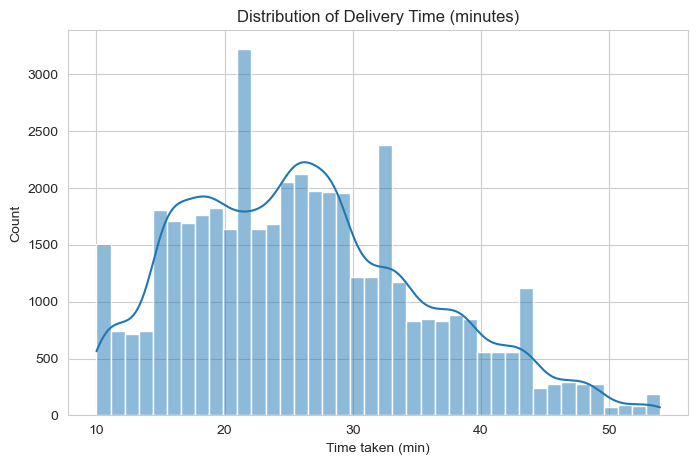
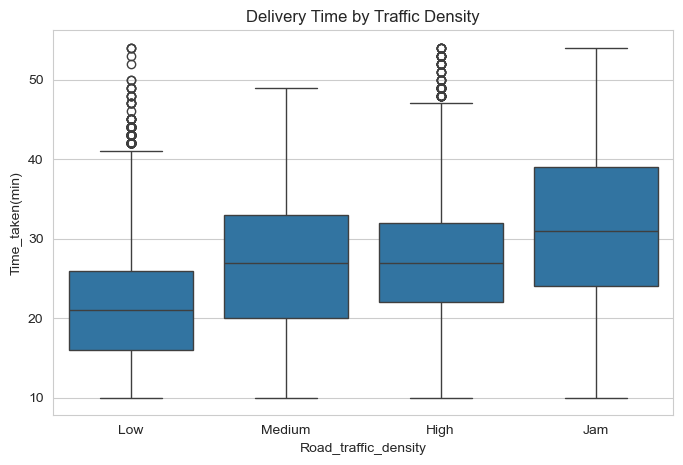
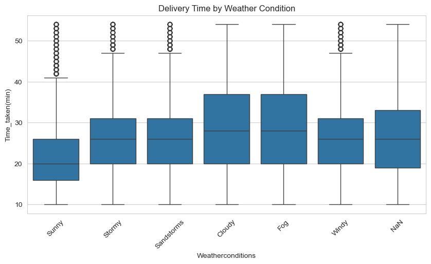
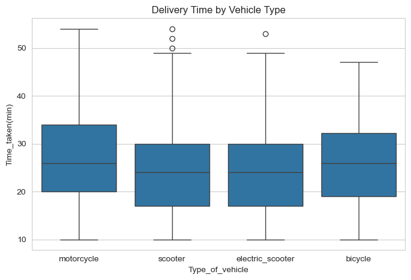
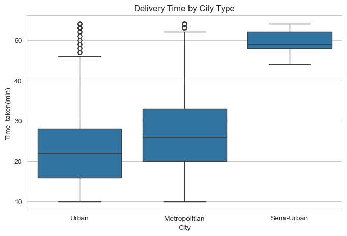
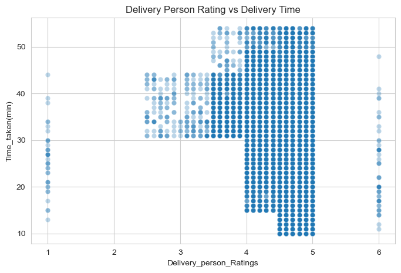
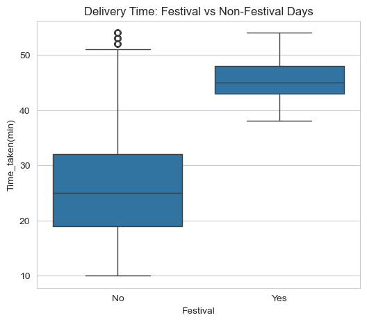
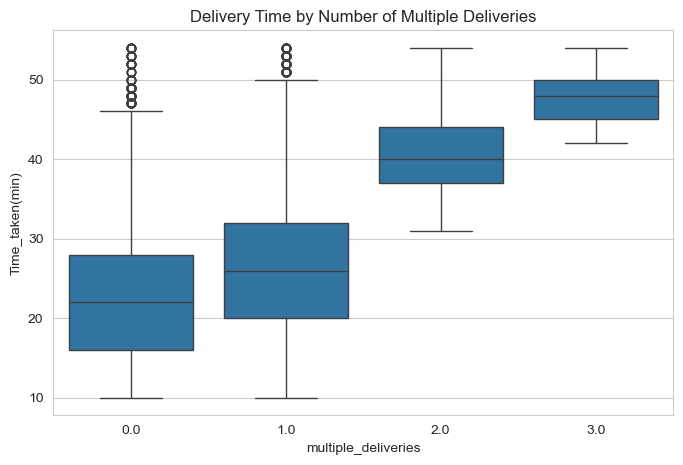
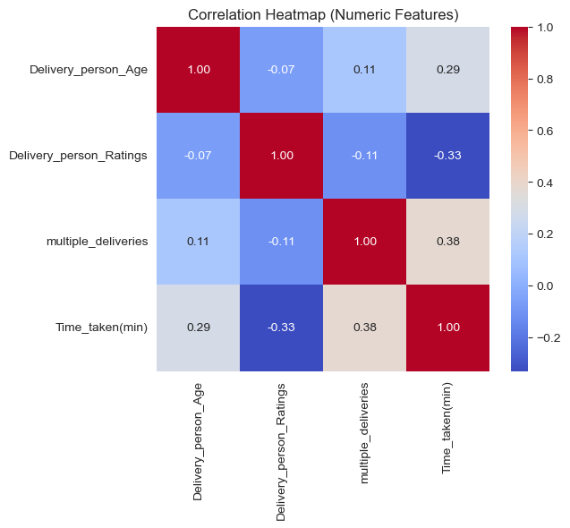
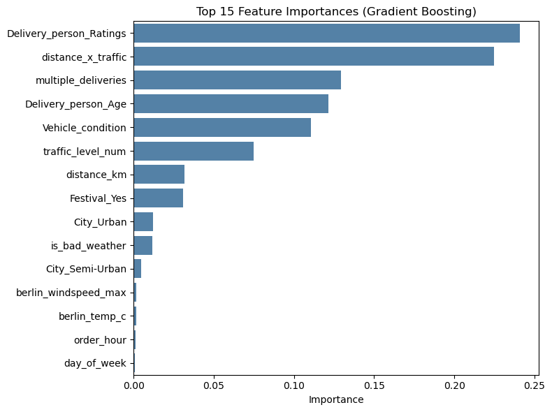

# Berlin Food Delivery ETA Prediction

ML regression project predicting food delivery times using distance, weather, traffic, and order context. Built with real coordinates (haversine distance), feature engineering, and model comparison across Linear Regression, Decision Trees, Random Forest, and XGBoost/Gradient Boosting with hyperparameter tuning. Enriched with real historical Berlin weather data. By a former Wolt delivery rider.

**Presentation slides:** [Add link here]

---

## Project Overview

This project predicts food delivery time (in minutes) using order context, delivery distance, traffic density, weather conditions, and delivery person attributes. It was built as part of the Ironhack Data Analytics / Machine Learning module (July 2026), covering the full ML workflow: data cleaning, exploratory data analysis, feature engineering, supervised learning, ensemble methods, and hyperparameter tuning.

As a Wolt delivery rider in Berlin, this project combines firsthand domain intuition with a structured ML approach to validate what actually drives delivery delays.

---

## Problem Statement

**Goal:** Predict delivery time (minutes) for a food delivery order based on distance, traffic, weather, and delivery context.

**Type:** Supervised regression

**Target variable:** `Time_taken(min)`

---

## Dataset

- **Source:** Food delivery dataset (Kaggle-style train/test split with sample submission format)
- **Size:** 45,593 training rows, 11,399 test rows, 20 raw columns
- **Key raw features:** delivery person age/rating, restaurant & delivery coordinates, order/pickup timestamps, weather conditions, traffic density, vehicle type, multiple deliveries flag, festival flag, city type

**Note:** The delivery data itself is not literally sourced from Berlin. It was enriched with **real historical Berlin weather data** (temperature, precipitation, wind speed via the Open-Meteo API) matched by order date, to add a genuine local dimension and demonstrate real-world external data enrichment. This is an illustrative "what if this were Berlin" enrichment rather than a claim that deliveries physically occurred in Berlin — a limitation openly discussed in the results.

---

## Project Structure

```
berlin-food-delivery-eta-prediction/
│
├── data/
│   ├── train.csv
│   ├── test.csv
│   └── Sample_Submission.csv
│
├── notebooks/
│   ├── 01_data_cleaning_eda.ipynb
│   ├── 02_feature_engineering.ipynb
│   ├── 03_modeling.ipynb
│   └── 04_hyperparameter_tuning.ipynb
│
├── images/
│   └── (see "Visuals" section below for what goes here)
│
├── final_tuned_gb_model.pkl
├── model_comparison_baseline_vs_ensemble.csv
└── README.md
```

---

## Methodology

### 1. Data Cleaning
- Parsed the malformed target column (`Time_taken(min)` stored as text)
- Fixed literal `"NaN"` strings hidden in categorical columns
- Stripped whitespace/prefixes from categorical fields (e.g. `Weatherconditions`)
- Converted mistyped numeric columns (age, ratings) to proper numeric types
- Imputed missing values (median for numeric, mode for categorical)

### 2. Exploratory Data Analysis
- Analyzed delivery time distribution and relationships with traffic, weather, vehicle type, city type, delivery person rating, festival days, and multiple deliveries
- Identified small-sample caveats (e.g. Semi-Urban city type and Festival days were under-represented, so strong-looking patterns there were flagged as low-confidence rather than headline findings)

### 3. Feature Engineering
- **Haversine distance** calculated from restaurant/delivery coordinates (straight-line proxy for travel distance); capped at 30km after identifying corrupted coordinate outliers
- **Datetime features**: order hour, day of week, weekend flag, rush hour flag
- **Prep time**: time between order placed and picked up
- **Interaction features**: distance × traffic density, bad weather flag
- **Berlin weather enrichment**: merged real historical Berlin weather by date via the Open-Meteo API (an initial date-range assumption error was caught and corrected mid-process — documented as part of the data quality process)
- One-hot encoding of categorical variables with explicit train/test column alignment

### 4. Modelling — Baselines & Ensembles
Trained and compared four models:
- Linear Regression (baseline)
- Decision Tree Regressor (baseline)
- Random Forest Regressor (ensemble)
- Gradient Boosting Regressor (ensemble)

### 5. Hyperparameter Tuning
- Tuned the Gradient Boosting model using `RandomizedSearchCV` (25 candidates × 3-fold CV)
- Compared tuned vs. default performance and confirmed no overfitting via train/validation gap analysis

---

## Results

| Model | MAE | RMSE | R² |
|---|---|---|---|
| Linear Regression | 5.103 | 6.443 | 0.527 |
| Decision Tree | 4.297 | 5.455 | 0.661 |
| Random Forest | 4.211 | 5.325 | 0.677 |
| Gradient Boosting (default) | 4.216 | 5.323 | 0.677 |
| **Gradient Boosting (tuned)** | **4.178** | **5.287** | **0.681** |

**Best model:** Tuned Gradient Boosting Regressor (`n_estimators=100, max_depth=6, learning_rate=0.05, subsample=0.7, min_samples_split=2`)

### Top predictors (feature importance)
1. Delivery person rating
2. Distance × traffic interaction
3. Number of multiple deliveries
4. Delivery person age
5. Vehicle condition

Berlin weather features showed minimal importance — an expected and openly reported limitation, since the underlying delivery records aren't literally tied to real Berlin locations/dates. The enrichment step demonstrates the technique (external API integration, date-based merging) rather than adding genuine signal to this particular dataset.

---

## Visuals

### Target Distribution

 
### Delivery Time by Traffic Density

 
### Delivery Time by Weather Condition

 
### Delivery Time by Vehicle Type

 
### Delivery Time by City Type

 
### Delivery Person Rating vs. Delivery Time

 
### Festival vs. Non-Festival Days

 
### Delivery Time by Number of Multiple Deliveries

 
### Correlation Heatmap (Numeric Features)

 
### Feature Importance (Gradient Boosting)


## Tools & Technologies

- **Language:** Python
- **Data manipulation:** Pandas, NumPy
- **Visualization:** Matplotlib, Seaborn
- **Machine Learning:** Scikit-learn (Linear Regression, Decision Tree, Random Forest, Gradient Boosting, RandomizedSearchCV)
- **External data:** Open-Meteo API (historical Berlin weather)
- **Environment:** Jupyter Notebook

---

## Limitations & Future Work

- Distance is calculated as straight-line (haversine) rather than actual road/route distance, since no routing API was used
- Berlin weather enrichment is illustrative rather than literal, since the delivery records aren't genuinely Berlin-based — a truly Berlin-native dataset would likely show stronger weather effects
- Hyperparameter tuning yielded incremental (not dramatic) gains, consistent with Gradient Boosting's defaults already performing reasonably well
- Future work could include: routing-API-based distance, a genuinely Berlin-sourced delivery dataset, XGBoost/LightGBM comparison, and deployment as a simple prediction API or Streamlit app

---

## Author

**Akash Samantray**
Data Analyst | Berlin, Germany
[https://www.linkedin.com/in/akash-samantray/] · [https://github.com/Akash-045]

---

## Acknowledgments

Built as part of the Data Analytics/Machine Learning training at Ironhack Berlin.